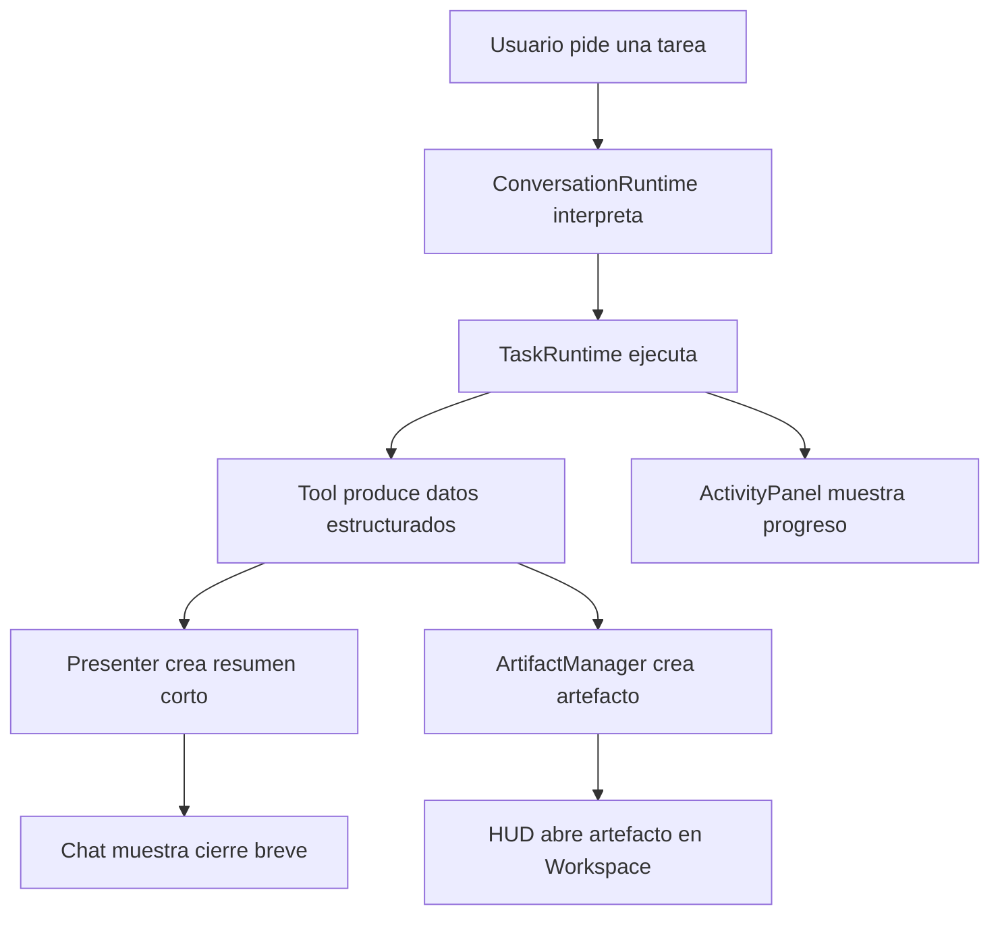

# Arquitectura del HUD

## Tesis

El HUD de Jarvis no debe ser una pantalla unica. Debe ser una shell de trabajo: una capa visual que recibe eventos, abre artefactos, muestra progreso, pide aprobaciones y permite ejecutar superpoderes sin llenar el chat de ruido.

## Componentes Principales

### `HudShell`

Contenedor principal.

Responsabilidades:

- Layout responsive.
- Estado global visual.
- Dock de superpoderes.
- Registro de ventanas.
- Entrada principal de comando.

### `CommandPanel`

Conversacion y voz.

Responsabilidades:

- Enviar comandos.
- Mostrar respuestas cortas.
- Mostrar estado de escucha/habla.
- No renderizar resultados largos.

### `ArtifactWorkspace`

Zona central de resultados.

Responsabilidades:

- Renderizar artefactos.
- Mantener tabs o ventanas internas.
- Abrir vista especializada segun tipo.
- Permitir exportar o enviar a ventana satelite.

### `ActivityPanel`

Estado operativo.

Responsabilidades:

- Tareas activas.
- Progreso.
- Errores.
- Confirmaciones pendientes.
- Historial reciente.

### `PowerDock`

Accesos a superpoderes.

Responsabilidades:

- Mostrar poderes habilitados.
- Mostrar estado del modulo.
- Abrir panel correspondiente.
- Evitar menus infinitos.

### `SatelliteWindow`

Ventana externa opcional.

Responsabilidades:

- Mostrar un artefacto o panel en otra ventana.
- Sincronizar estado minimo con la ventana principal.
- Cerrar limpiamente.

## Flujo de Resultado Largo

## Tipos de Artefacto Iniciales

| Tipo | Vista |
| --- | --- |
| `email_digest` | lista ordenada de correos con remitente, fecha, asunto y resumen |
| `calendar_briefing` | timeline de eventos y preparacion |
| `report` | visor de reporte con secciones |
| `google_doc` | enlace, resumen y acciones |
| `web_research` | fuentes, hallazgos, confianza |
| `seo_audit` | checklist, severidad, acciones |
| `file_list` | tabla de archivos |
| `screenshot` | imagen con OCR y observaciones |
| `task_log` | pasos, eventos y errores |
| `approval` | decision pendiente |

## Reglas de Enrutamiento Visual

- Si el resultado cabe en tres frases, puede ir en chat.
- Si tiene listas, tablas, fuentes o secciones, va a artefacto.
- Si requiere aprobacion, va a `ActivityPanel`.
- Si es configuracion, va a panel especializado.
- Si es debugging, solo aparece en modo operador/desarrollador.

## Eventos Requeridos

El HUD no debe adivinar. Debe reaccionar a eventos.

- `task_started`
- `task_progress`
- `task_needs_confirmation`
- `task_completed`
- `task_failed`
- `artifact_created`
- `artifact_updated`
- `window_opened`
- `window_detached`
- `window_closed`
- `voice_started`
- `voice_finished`

## Prioridad de Implementacion

1. Crear `ArtifactManager` basico.
2. Crear tipos `email_digest`, `calendar_briefing` y `report`.
3. Cambiar chat para mostrar resumen corto y abrir artefacto.
4. Crear workspace con tabs simples.
5. Crear activity panel con tareas y aprobaciones.
6. Crear dock de superpoderes.
7. Agregar ventanas internas movibles.
8. Agregar ventanas satelite.
9. Preparar capa de gestos.

## Decision Importante

No conviene seguir agregando poderes grandes al HUD actual. Primero hay que darle al producto una estructura visual donde esos poderes puedan vivir sin competir por el mismo espacio.
